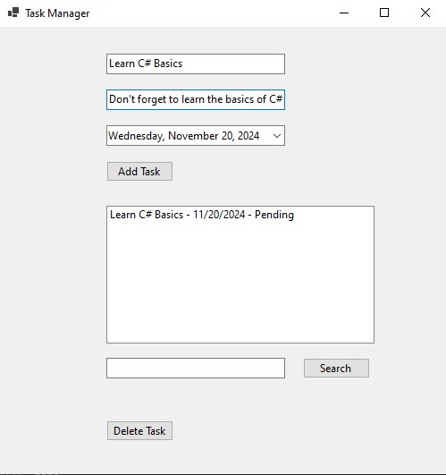

# Task Manager Application (Windows Forms)

A simple task manager application built using C# and Windows Forms. This application allows users to add, edit, delete, and manage tasks. It showcases basic CRUD (Create, Read, Update, Delete) operations and is a great way to get familiar with Windows Forms and C# development.

## Features

- **Add Tasks**: Add new tasks with a title and description.
- **View Tasks**: View the list of all tasks.
- **Edit Tasks**: Edit the details of existing tasks.
- **Delete Tasks**: Remove tasks from the list.
- **Task Completion**: Mark tasks as completed or not completed.
- **Save and Load Tasks**: Task data is stored locally to ensure it persists even after closing the application.

## Technologies Used

- **C#**
- **Windows Forms**
- **.NET Framework**

## Screenshots

 

## Installation

1. Clone the repository:
   ```bash
   git clone https://github.com/avyaktrout/task-manager.git
